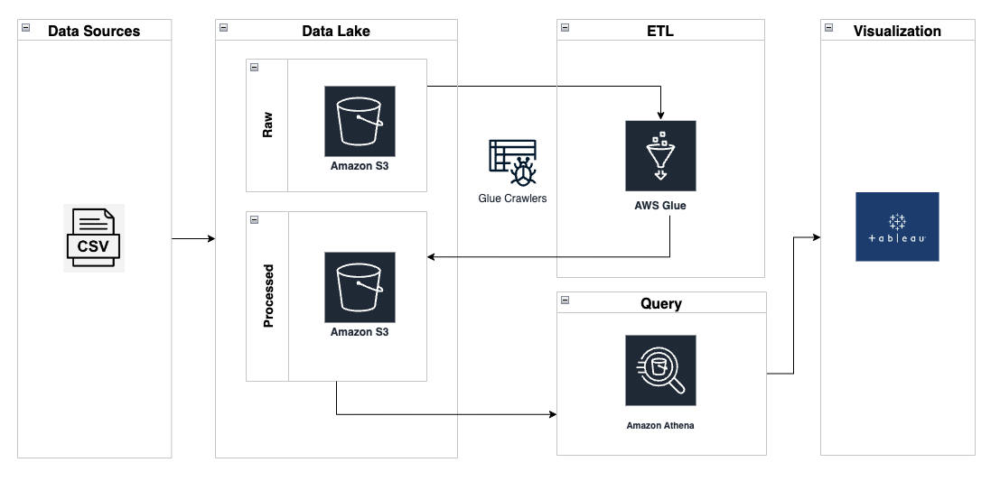

# Carbon Data Analysis
This is a simple ETL processing job and analysis ran on AWS. The analysis sought to understand the effect of national carbon pricing mechanisms (carbon taxes or cap-and-trade) on countries' CO2 Emissions. More specifically,

- How did countries’ rate of annual carbon emissions (from fossil fuels & land use) change in response to their national carbon pricing?
- Is there a correlation between carbon pricing & any reduction in carbon emissions?
- Which countries' national carbon pricing initiatives appear to be the most effective in reducing its carbon emissions?

## Data Sources
[World Carbon Pricing Dataset, Kaggle](https://www.kaggle.com/datasets/michaelbryantds/world-carbon-pricing)
[Annual CO2 Emissions, Our World in Data](https://ourworldindata.org/co2-emissions#annual-co2-emissions)

## Assumptions
- Did not distinguish taxes by IPCC code & product, took the average tax across those dimensions instead.

## Architecture Diagram

## Visualization
The results are presented as a [Tableau viz]().

## Future Work
- Abstract the data standardization & cleaning functions into a separate upstream job
- Switch to more current and frequently updated data sources - and accordingly, automate batch fetches or streaming data, and schedule workflow run